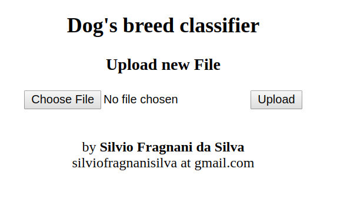
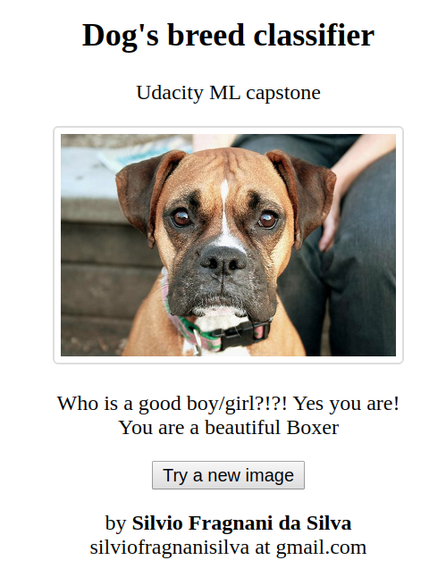
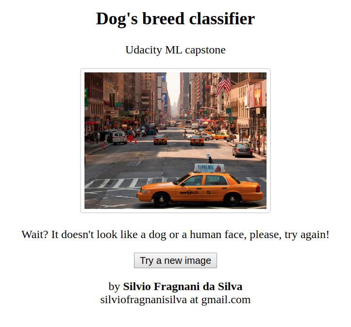
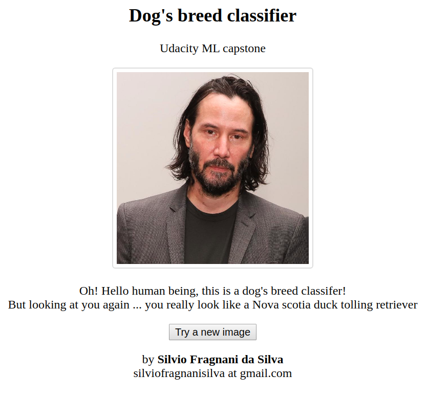

## **Dog's breed classifer**
#### **Machine Learning Capstone Project - Udacity**

The goal of this project is to explore the machine learning approach to classifer images, in this case, dog's breed.
The architecture of Neural Network to achieve this it's called [Convolutional Neural Network (CNN)](http://cs231n.github.io/convolutional-networks/).

 
You can find the orignal repository from Udacity https://github.com/udacity/deep-learning-v2-pytorch.git, directory `deep-learning-v2-pytorch/project-dog-classification`

  
**The final algorithm should load an image as input and classify as following**
- In case of a dog, predict the dog's breed;
- In case of a human face, predict a dog's breed which that human face resembled it;
- In case of neither dog or human, it should provide an error
  

**The steps to achieve this goal**
- Datasets
    - Download
    - Loading 
    - Pre-processing
- Human face detection
    - OpenCV haar cascade to match a human face
- Dog's detection
    - Pre-trained network like ResNet50 and VGG16 with 1000 classes, providing great accuracy
- Dog's breed classifier
    - Train a model from scratch
    - Use transfer learning to use the already trained models as a base for our model

**Tools used on this project**
- [Jupyter notebook](https://jupyter.org/) / [AWS Sagemaker Notebook](https://aws.amazon.com/sagemaker/), Jupyter Notebook is an open-source web application that allows you to create and share documents that contain live code, equations, visualizations and narrative text. It was used from data exploration to final algorithm tests
- [PyTorch](https://pytorch.org/), open source machine learning library based on the Torch library. It was used to developer the CNN models to predict the dog's breed
- [OpenCV](https://opencv.org/), open source computer vision and machine learning software library. It was used to identify the human face
- [Matplotlib](https://matplotlib.org/), plotting library which produces publication quality figures. It was used to show images and plot graphs
- [NumPy](https://numpy.org/), library which adds support for large, multi-dimensional arrays and matrices, along with a large collection of high-level mathematical functions to operate on these arrays.

**Devices used for testing**
- AWS Sagemaker notebooks (small instance and a big one with GPU to speed up the training)
- Notebook i7, 16GB RAM, Nvidia 1070
  

---

### Web app
On the folder `web` is available on this repository a small web project which currently is deployed on [AWS EC2](http://ec2-3-223-194-180.compute-1.amazonaws.com/).

It receives the image, process it loads the trained model and predicts the outcome base on the algorithm defined above.

- The first screen, to input the image

- Result screen with a dog image input

- Result screen with a non dog or human image input

- Result screen with a human face and predicting the dog's breed to that face

